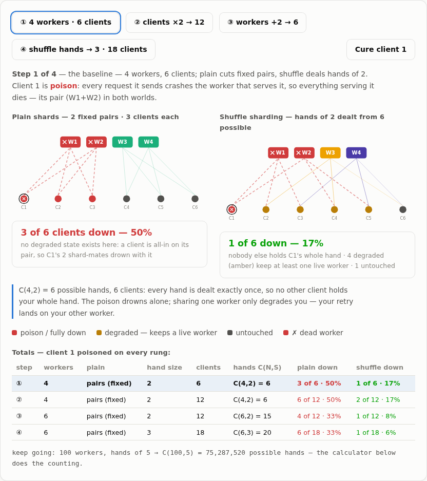
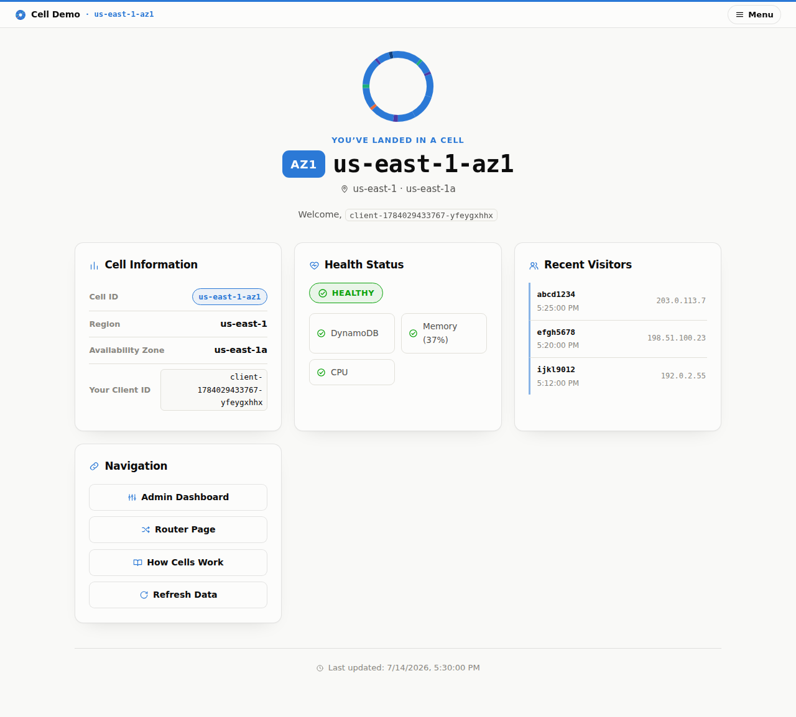
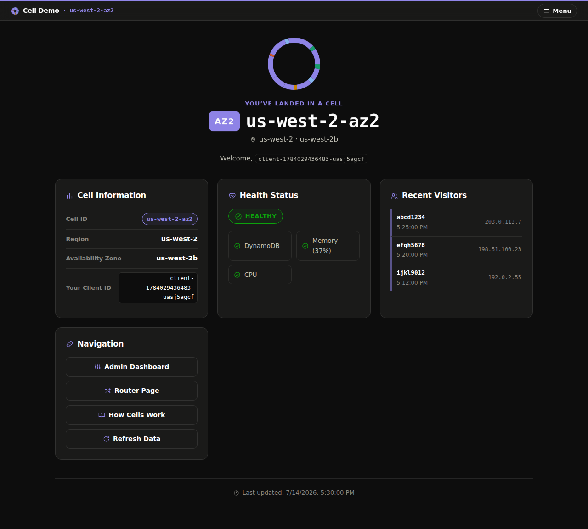
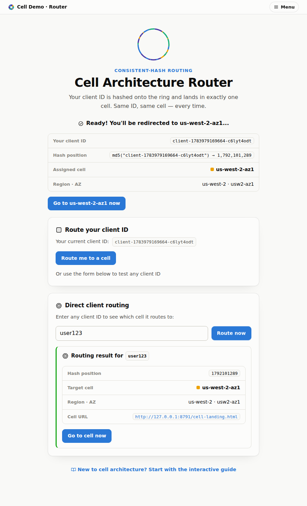
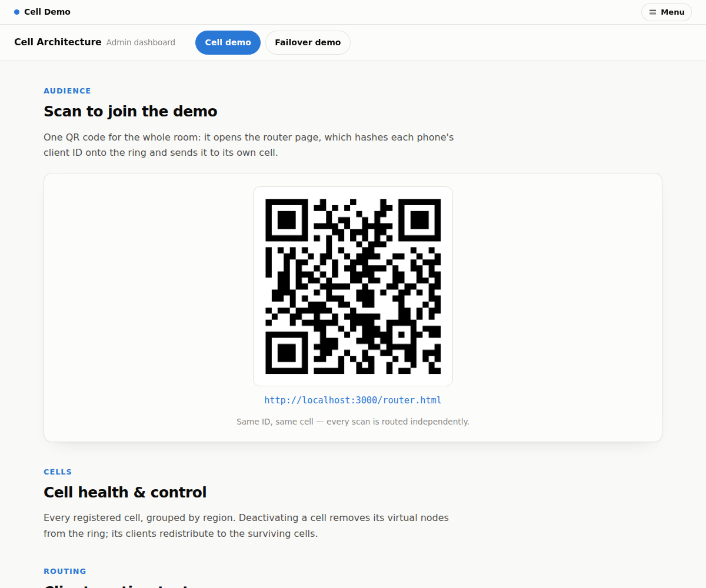

# Cell-Based Architecture — an Educational Demo

Cell-based architecture is a resilience pattern used by AWS, Netflix, Slack, and
others: instead of running one large system, you partition your workload into
many small, **isolated, self-contained replicas ("cells")** and deterministically
route each client to exactly one of them. When a cell fails, only the clients in
that cell are affected — the blast radius shrinks from 100% to 1/N.

This repository teaches that pattern two ways:

1. **📖 Learn it in your browser** — a self-contained interactive site in
   [`site/`](site/) that simulates a hash ring, client routing, cell failure,
   and scaling with zero AWS setup. Build it with `npm run build:site` or open
   the dev server with `cd site && npm run dev`. It has grown into three
   surfaces sharing one design system:

   - **The interactive guide** — eight numbered lessons (the problem, the
     ring, routing, failure, scaling, a consistent-hashing "algorithm zoo",
     shuffle sharding & friends, trade-offs), every diagram powered by the
     repository's real MD5 ring code. Optional **sidequests** expand for
     deeper dives: hash-library drift, pinning clients (and what happens when
     the pinned cell dies), and how to run the registry/control plane without
     making it a single point of failure.
   - **A cloud-neutral primer** (`primer.html`) — the problem before the
     pattern, with AWS/Azure/Google terminology bridges and an isolation
     stepper comparing AZs, regions, microservices, shards, and cells.
   - **A presentation deck** (`slides.html`) — 16 reveal.js slides that embed
     the same live demos, driven by arrow-key phase scripts, presenter
     hotkeys, and a touch bar for iPad/iPhone; the narrative lives in speaker
     notes.

   

   **Hosting** (no AWS involved): the site auto-deploys on Vercel from GitHub —
   the root `vercel.json` builds and serves only `site/`, and every push to
   `main` ships it. Point your `siteDomainName` (e.g. `cellintro.example.com`)
   at the Vercel project, and set the project's `DEMO_ADMIN_URL` env var to
   your deployed admin URL so the site's "Live demo" links render. Merging to
   `main` also publishes to GitHub Pages via `.github/workflows/pages.yml`.
2. **🛠️ Deploy it for real** — a full serverless implementation on AWS (Lambda,
   DynamoDB, API Gateway, CloudFront, Route 53) that you can stand up in your
   own account. See [QUICKSTART.md](QUICKSTART.md).

## The core ideas

- **Cells**: independent deployment units in specific regions and AZs; a cell
  never depends on another cell (or another region) at runtime
- **Consistent hashing**: MD5-based hash ring with virtual nodes deterministically
  maps every client ID to one cell — the same client always lands in the same cell
- **Fault isolation**: killing a cell only remaps that cell's clients (~1/N of
  traffic); everyone else is untouched
- **Thin routing layer**: the only shared component, kept as simple as possible
  because its availability bounds the whole system's availability

## Repository layout

```
cells/
├── site/            # Interactive educational site (no AWS required)
├── backend/
│   ├── lambda/      # Lambda function handlers
│   └── lib/         # Shared consistent-hash implementation (used by backend, admin UI, and site)
├── frontend/
│   ├── spa/         # Per-cell page (React)
│   ├── admin/       # Admin dashboard (React)
│   └── router/      # Static router pages
├── infrastructure/
│   ├── templates/   # SAM/CloudFormation templates (global resources, routing layer, cell)
│   └── scripts/     # deploy.sh / deploy-frontend.sh / cleanup.sh
└── tests/           # Playwright E2E suite (parameterized by env vars)
```

## Deploying to AWS

### Quick start

```bash
cp config.example.json config.json   # then edit with your values
./setup.sh
```

See [QUICKSTART.md](QUICKSTART.md) for the full walkthrough, configuration
reference, and troubleshooting. `config.json` is gitignored — it holds your
account-specific values (SAM bucket, domain, hosted zone).

### What gets deployed

- **Global resources** (`global-resources.yaml`): cell registry and client
  tracking DynamoDB tables, EventBridge bus
- **Routing layer** (`routing-layer.yaml`, us-east-1): routing + admin Lambdas,
  API Gateway, admin dashboard bucket/CloudFront
- **One stack per cell** (`cell-template.yaml`): per-cell S3+CloudFront, API
  Gateway, Lambdas, DynamoDB table, CloudWatch dashboard

With a custom domain: cells at `{cell-id}.{domain}`, admin at
`admin.{domain}`, API at `api.{domain}`; ACM certificates are created
automatically.

### What the demo looks like

**Each cell is visibly its own site.** Every cell page carries the ring mark
tinted with that cell's palette color (the same color the admin dashboard and
the educational site assign it), so an audience can tell at a glance they
landed somewhere different than their neighbor:

| `us-east-1-az1` (light) | `us-west-2-az2` (dark) |
|---|---|
|  |  |

**One QR code routes the whole room.** The admin dashboard's "Scan to join"
card encodes the router page; each phone that scans it gets its client ID
hashed onto the ring and lands in its own cell — same ID, same cell, every
time:

| Router page | Scan-to-join card |
|---|---|
|  |  |

### Single-hostname mode (optional)

For audiences behind corporate proxies, the demo's normal topology is a
problem: the router, the routing API, and every cell live on different
hostnames, each of which would need allowlisting. Setting
`"edgeDomain": "go"` in `config.json` deploys one extra CloudFront
distribution (`demo-edge.yaml`, stack `{project}-edge`) that serves
**everything the audience touches from a single DNS name**,
`go.{domainName}`:

| Path | Serves |
|------|--------|
| `/` | router page (QR target), `/auto.html`, admin at `/index.html` |
| `/api/*` | the routing API |
| `/{cellId}/*` | that cell's page |
| `/{cellId}/api/*` | that cell's API (rewritten to its `/prod` stage) |

The router pages switch to relative `/api` calls and `/{cellId}/`
redirects, and each cell SPA detects its own path prefix at runtime and
uses `/{cellId}/api` — no extra build variants.

**The honest trade-off:** the edge distribution is a shared dependency in
front of all client traffic — exactly the "central router" topology the
trade-offs discussion warns against, chosen deliberately here for demo
convenience. If the edge distribution fails, every cell is unreachable for
the audience, even though the cells themselves remain isolated from each
other (each `/{cellId}/api/*` path still hits only that cell's own API).
Point that out when you present it; it makes the lesson sharper.

### Environment variables (alternative to config.json)

- `SAM_BUCKET`: S3 bucket for SAM package uploads (required)
- `PROJECT_NAME`: resource name prefix (default: cell-demo)
- `REGIONS`: comma-separated regions (default: us-east-1,us-west-2)
- `AZS_PER_REGION`: AZs per region (default: 2)
- `DOMAIN_NAME` / `HOSTED_ZONE_ID`: custom domain (optional)
- `EDGE_DOMAIN`: subdomain label for single-hostname mode (optional)

### Cleanup

```bash
cd infrastructure/scripts && ./cleanup.sh
```

## API overview

- **Routing API**: `GET /route/{clientId}` — cell assignment for a client
- **Admin API**: `GET /admin/cells`, `PUT /admin/cells/{cellId}`,
  `GET /admin/hash-ring`, `GET /admin/client-route/{clientId}`,
  `GET /admin/cell-urls`, `POST /qr-code`
- **Cell API** (per cell): `GET /info`, `GET /health`, `POST /track-client`,
  `GET /clients/cell/{cellId}`

See [API_REFERENCE.md](API_REFERENCE.md) for details and
[DEMO_SCRIPT.md](DEMO_SCRIPT.md) for a 20-minute live-presentation script.

## How it works

1. **Cell registration**: each cell heartbeats into the global registry table
   every 5 minutes. The heartbeat only refreshes liveness (`lastHeartbeat`,
   a 10-minute `ttl`) and static facts — it never touches operator state, so
   an admin's deactivate sticks
2. **Liveness, two ways**: a cell leaves the ring either **deliberately**
   (the admin API flips its `active` flag — a single boolean, no DNS, takes
   effect on the next routing decision) or **automatically** (its heartbeats
   stop, its `ttl` passes, and every ring builder treats the expired row as
   gone — DynamoDB's TTL deletion also reaps it, but readers don't wait for
   that)
3. **Consistent hashing**: the routing Lambda MD5-hashes the client ID onto a
   ring of virtual nodes (see `backend/lib/consistent-hash.ts` — the same code
   powers the backend, the admin dashboard, and the educational site, anchored
   by a shared golden-value test)
4. **Load distribution**: virtual nodes (150 per weight-1.0 cell) smooth out
   the distribution
5. **Failover**: excluded cells' clients deterministically remap to the
   survivors — exactly their keyspace share moves, nobody else
6. **Monitoring**: per-cell health checks and the admin dashboard

## Testing

- **Unit tests**: `cd backend && npm test` (jest; covers the hash ring)
- **E2E tests**: `cd tests && npm test` against a deployment — endpoints are
  supplied via env vars (see [tests/README.md](tests/README.md)); suites skip
  cleanly when no deployment is configured

## License

MIT
